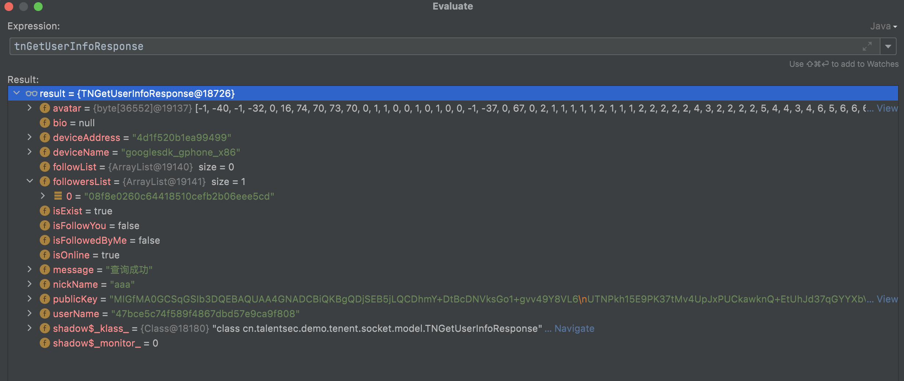

1. TNClientInitializer.class里面没有用TLS加密 文档说用了
2. 文档中说用对方的公钥加密，也被注释了，实际上没有加密
3. 


# 于服务端交互的信息

* 主要在NettyService中

1. 注册用户:
   1. TNRegisterRequest(rUserName, rPasswd, rNickName, rPublicKey, machineId, deviceName) 
   2. TNLoginResponse
2. 用户登陆:
   1. new TNLoginRequest(userName, password, machineId, deviceName)
3. 用户注销:
   1. 关闭长连接netty_ctx.close()
4. 发送消息:
   1. netty_ctx.writeAndFlush((TNSendMessage) msg.obj)
5. 发送文件:
   1. TNFileSendData tnFileSendData = (TNFileSendData) msg.obj;
6. 查询用户信息:
   1. TNSearchUserInfoRequest((String)msg.obj)
7. 查询用户群信息：
   1. TNSearchGroupInfoRequest((String)msg.obj,userName)
   2. 没有实装
8. 通过公钥查询用户信息
   1. TNSearchUserInfoRequestByPublicKey((String)msg.obj)
9. 创建群聊
   1.  TNCreateGroupRequest tnCreateGroupRequest = (TNCreateGroupRequest) msg.obj
   2.  没有实装
10. 添加好友
    1.  TNFollowRequest(username, name)

# 1. 客户端与服务端一些功能性交互的信息 

## 1.1 用户注册

### 1.1.1 客户端向服务端发送请求

1. 使用的是TNRegisterRequest这个类

```java
public class TNRegisterRequest implements Serializable {
    private String userName;
    private String password;
    private String nickName;
   // 公钥是通过RSA算法生成的，再确定创建用户时生成
   // 生成的私钥会在注册成功后放入本地的数据库
    private String publicKey;
    private String macAddress;
    private String macName;
   // 头像的二进制数组
    private byte[] avatar;

    public TNRegisterRequest(String userName, String password, String nickName, String publicKey, String macAddress,String macName) {
        this.userName = userName;
        this.password = password;
        this.nickName = nickName;
        this.macAddress = macAddress;
        this.macName = macName;
        this.publicKey = publicKey;
    }

    ...
}
```

2. 一个注册请求示例
   1. 密码password和userName都经过了md5加密


### 1.1.2 服务端向客户端返回请求

1. 使用的是TNRegisterResponse类
   1. message的可能值:
      1. "注册成功"
      2. "注册失败，该用户名已经存在"
      3. "注册失败"
   2. 主要根据isRegistered判断是否注册成功

```java
public class TNRegisterResponse implements Serializable {
    private boolean isRegistered;
    private String message;
    private String publicKey;

    public TNRegisterResponse(boolean isRegistered, String message, String publicKey) {
        this.isRegistered = isRegistered;
        this.message = message;
        this.publicKey = publicKey;
    }
    ...
}

```

2. 一个注册返回示例


3. 如果注册成功将用户信息存储到本地

```java
UserInfo userInfo = new UserInfo(
//                                            String.valueOf(binding.editTextRegisterUsername.getText()),
         MD5Util.getStringmd5(String.valueOf(binding.editTextRegisterUsername.getText())),
         null,
         String.valueOf(binding.editTextRegisterNickname.getText().toString()),
         rsaPublicKey,
         AESEncrypt.encrypt(rsaPrivateKey,String.valueOf(binding.editTextRegisterPassword1.getText().toString())+MD5substring),
//                                    rsaPrivateKey,
         deviceName,
         machineId,
         0
);
```

## 1.2 用户登陆

### 1.2.1 客户端向服务端发送请求

1. 使用的是TNLoginRequest这个类

```java
public class TNLoginRequest implements Serializable {
    private String userName;
    private String passwd;
    // session没有实装
    private String session;
    private String machineId;
    private String macName;

    public TNLoginRequest(String userName, String passwd, String machineId, String macName) {
        this.userName = userName;
        this.passwd = passwd;
        this.machineId = machineId;
        this.macName = macName;
    }
    ...
}
```

2. 一个登陆请求实例
   1. passwd和userName都经过了md5加密


### 1.2.2 服务端向客户端的回应

1. 主要使用的是TNLoginResponse这个类
   1. 根据isLogined判断是否登陆成功
   2. message可能值:
      1. "登陆成功"
      2. "用户名或密码错误"
      3. "该设备未绑定此账号，访问被拒绝"

```java
public class TNLoginResponse implements Serializable {
    private boolean isLogined;
    private String message;
   //  session没有实装
    private String session;
    private String userName;

    public TNLoginResponse(boolean isLogined, String message) {
        this.isLogined = isLogined;
        this.message = message;
    }

    ...
}
```

2. 一个登陆返回实例
   1. 里面的session没有实装


## 1.3 登陆后获取用户信息

### 1.3.1 客户端向服务端请求

* 在登陆成功后会发送请求向服务端获取用户的信息

1. 使用的是TNGetUserInfoRequest这个类
   1. 只用用户名一个属性，通过用户名向服务器获取信息

```java
public class TNGetUserInfoRequest implements Serializable {
    private String userNameToGet;

    public TNGetUserInfoRequest(String userNameToGet) {
        this.userNameToGet = userNameToGet;
    }
   ...
}
```

### 1.3.2 服务端返回用户信息

1. 使用TNGetUserInfoResponse这个类
   1. followList存放的是你加了好友的ueserName（经过md5加密后的)
   2. followersList存放的是加了你好友的ueserName（经过md5加密后的)

```java
public class TNGetUserInfoResponse implements Serializable {
    String userName;
    String nickName;
    String bio;
    String publicKey;
    String deviceName;
    String deviceAddress;
    byte[] avatar;

    boolean isExist;
    boolean isOnline;
    boolean isFollowYou = false;
    boolean isFollowedByMe = false;

    List<String> followList;
    List<String> followersList;

    String message;

    public TNGetUserInfoResponse(boolean isExist, String userName, String message) {
        this.isExist = isExist;
        this.userName = userName;
        this.message = message;
    }
   ...
}
```

2. 一个返回示例



1. 这个类可以根据用户名返回用户的头像、好友、公钥等信息，在登陆后会向服务器请求登陆用户的信息，更新用户的好友列表

# 2 服务器和客户端消息的交互

* 消息类型，使用了一个枚举类来区分消息类型

```java
public enum MsgType {
    TEXT ,//文本消息
    IMAGE ,//图片消息
    FILE ,//文件消息
    VIDEO ,//视频消息
    AUDIO ,//语音消息
    LOCATION, //位置消息
}
```

## 2.0 TNSendMessage的结构

```java
public class TNSendMessage implements Serializable {
    private String uuid;
    //是群消息还是个人消息
   //  群聊没有实装
    private int type;
    // 文字0，图片1，文件2，视频3，语音4
    private int contentType;
    private int sendStatus;
    private String author;
    private String nameToMessage;
    private String groupToMessage;
   //  一个给对方的消息，用对方的公钥加密
    private String message;
   //  一个发送到服务端等服务端发回来的消息用自己的公钥加密
    private String messageToMe;
    private String sendTime;
    // 文件加解密
    private String key;
    private String keyToMe = "";

    // 是否是历史消息
    private boolean isHistory;

    //文件后缀名
    private String ext ;
    //文件名称,可以和文件名不同，仅用于界面展示
    private String displayName;
    //文件长度(字节)
    private long size;
    //本地文件保存路径
    private String localPath;
    //文件下载地址
    private String remoteUrl;
    //文件内容的MD5
    private String md5;
    //扩展信息，可以放置任意的数据内容，也可以去掉此属性
    private String extra;

    //缩略图文件的本地路径
    private String thumbPath;
    //缩略图远程地址
    private String thumbUrl;
    //缩略图的字节 (因为压缩过所以直接发)
    private byte[] thumb;
    //是否压缩(false:原图，true：压缩过)
    private boolean compress;
    //高度
    private int height;
    //宽度
    private int width;

    //视频消息长度
    private long duration;

    //是否是阅后即焚
    private int isFire;

    //阅后即焚时间
    private long fireTime;

    //是否是密聊
    private int isSecret;

    public TNSendMessage() {
    }

    public TNSendMessage(String uuid, int type, int contentType, int sendStatus, String author, String nameToMessage, String groupToMessage, String message, String messageToMe , String sendTime) {
        this.uuid = uuid;
        this.type = type;
        this.contentType = contentType;
        this.sendStatus = sendStatus;
        this.author = author;
      //   下面两个属性是接受方的username
        this.nameToMessage = nameToMessage;
      //   群聊功能没有实装
        this.groupToMessage = groupToMessage;
      //   给对方的消息
        this.message = message;
      //   给自己的消息
        this.messageToMe = messageToMe;
        this.sendTime = sendTime;
        this.keyToMe = "";
        this.isSecret = 0;
    }

    ...
}
```

## 2.1 文字信息

### 2.1.1 文字信息的发送

1. 发送消息代码详解

```java
//文本消息
// 这里的输入就是发送的消息，和mEtContent.getText().toString()相同
private void sendTextMsg(String message_text)  {
   // 这里的ChatMessage应该是用于UI展示
   final ChatMessage mMessgaeText=getBaseSendMessage(MsgType.TEXT);
   TextMsgBody mTextMsgBody=new TextMsgBody();
   try {
      // 用自己的公钥加密发送的信息
      byte[] encryptBymPublicKey = RSAUtils.encryptByPublicKey(mEtContent.getText().toString().getBytes(Charsets.toCharset("UTF-8")), mPublicKey);
      mTextMsgBody.setMessage(Base64.encodeToString(encryptBymPublicKey,Base64.DEFAULT));
   }catch (Exception e){
      e.printStackTrace();
      mTextMsgBody.setMessage(message_text);
   }finally {
      mMessgaeText.setMsgBody(gson.toJson(mTextMsgBody));

      //开始发送
      // 这里是更新UI
      // mMessageText中的MsgBody属性就是用自己公钥加密后的消息
      mAdapter.addData(mMessgaeText);
   }

   // 接下来是构建聊天消息的数据包结构，通过NettyService发送到服务端
   Message messageText = Message.obtain();
   messageText.what = 0x30;
   String messageToMe = "";
   String messageToContact = "";
   try {
      Log.d("mytest", "contact_name: "+contact_name);
      Log.d("mytest", "contact_publicKey: "+contact_publicKey);
      Log.d("mytest", "mPublicKey: "+mPublicKey);

      // 构建了两个字符串一个用自己的公钥加密，一个用对方的公钥加密
      // 这里是用自己的公钥加密,此消息最终由服务器发送给我，存到我自己的数据库
      byte[] encryptBymPublicKey = RSAUtils.encryptByPublicKey(mEtContent.getText().toString().getBytes(Charsets.toCharset("UTF-8")), mPublicKey);
      messageToMe = Base64.encodeToString(encryptBymPublicKey,Base64.DEFAULT);

      // 用对方的公钥加密的字符串，此消息最终由服务器发送给对方，存到对方的数据库
      byte[] encryptByContactPublicKey = RSAUtils.encryptByPublicKey(mEtContent.getText().toString().getBytes(Charsets.toCharset("UTF-8")), contact_publicKey);
//            messageToContact = Base64.encodeBase64String(encryptByContactPublicKey);
      messageToContact = Base64.encodeToString(encryptByContactPublicKey,Base64.DEFAULT);
   }
   catch (Exception e){
      e.printStackTrace();
   }
   finally {
      // 构建TNSendMessage
      TNSendMessage tnSendMessage = new TNSendMessage(mMessgaeText.getUuid(),contact_type,0,1,userName,contact_type==1?contact_name:"",contact_type==2?contact_name:"",messageToContact,messageToMe,"");
      messageText.obj = tnSendMessage;
      messageText.replyTo = chatMessageMessenger;
      try {
            mService.send(messageText);
      } catch (RemoteException e) {
            e.printStackTrace();
      }
   }

}
```

2. 一个文字消息发送示例


### 2.1.2 文字信息的接收

1. 依旧是使用TNSendMessage这个类

2. 一个接收示例
   1. 这个示例可以是上个示例的作者接收到的传递给自己的消息
   2. 相比于发送出去的消息的区别
      1. 已经是历史消息了
      2. 服务端填写了sendTime


3. 另一个接收示例
   1. 这是上个示例中接受方收到的消息
   2. 如果是在登陆状态下接收到对方的消息，那么就不是历史消息
   3. 如果在下线的时候对方发了消息，上线后显示接收，那么就是历史消息


## 2.2 图片信息

* 图片/视频/文件/语音消息本质上都是数据包结构告诉对方有这样一个数据，然后再分片将文件传输给对方

### 2.2.0 TNFileSendData的结构

```java
public class TNFileSendData implements Serializable {
   private String message_uuid;
//    private String file_uuid;
   private String sender_name; // 哪个用户传输的
   private String sender_machine; // 哪个用户传输的
   // 用户 1, 群 2
   private int receive_type;
   private String receive_name; // 哪个用户传输的
   private String receive_machine; // 哪个用户传输的
   private String receive_group;
   private long record_id; // 传输ID
   private boolean isHistory;

//    private byte[] token; // 数据合法性验证

   private String file;// 文件
   // 文字0，图片1，文件2，视频3，语音4
   private int file_type;
   private String file_hash;// md5
   private String file_name;// 文件名
   //文件后缀名
   private String ext ;

   private long starPos;// 开始位置
   private byte[] bytes;// 文件字节数组
   private long endPos;// 结尾位置
   private long start;

   private long size;

   ...
}
```

### 2.2.1 图片信息的发送

1. 代码分析

* 注意这里用的是ChatMessageActivity/ChatMessageSecretActivity里面的代码而不是ChatMessageFragment里面的！
* ChatMessageFragment也有sendImageMessage但是没有被调用

```java
private void sendImageMessage(final LocalMedia media) throws Exception {
   boolean isOneShotPhoto = false;
   String mediaPath = media.getPath();
   //这里需要更严格的判断，比方说 /PictureSelector/CameraImage/PictureSelector_20210224_181345.JPEG
   //将时间算进去，因为即拍即传的话，时间不会差很久
   Log.d("mytest11", "sendImageMessage: PictureSelector0: "+mediaPath.toLowerCase());
   // 下面是根据图片路径判断是否是即拍即传
   if (mediaPath.toLowerCase().contains("pictureselector")){
      isOneShotPhoto = true;
      Log.d("mytest11", "sendImageMessage: getCompressPath: "+media.getCompressPath());
   }

   // 以下到几行代码直到开始发送负责的是UI方面的内容
   final ChatMessage mMessgaeImage=getBaseSendMessage(MsgType.IMAGE);
   ImageMsgBody mImageMsgBody=new ImageMsgBody();
   mImageMsgBody.setThumbUrl(media.getCompressPath());
   mImageMsgBody.setThumbPath(media.getPath());
   mImageMsgBody.setExt(FileUtils.getFileExtension(media.getPath()));
   mMessgaeImage.setMsgBody(gson.toJson(mImageMsgBody));
   //开始发送
   mAdapter.addData( mMessgaeImage);
   Message messageImage = Message.obtain();
   messageImage.what = 0x30;

   // 构造TNSendMessage
   // contact_type：1是用户 ，2 是群
   // 群没有实装所以contact_type一直是1
   TNSendMessage tnSendMessage = new TNSendMessage(mMessgaeImage.getUuid(),contact_type,1,1,userName,contact_type==1?contact_name:"",contact_type==2?contact_name:"","[图片]","[图片]","");

   // 存储压缩后图片路径
   tnSendMessage.setThumbUrl(media.getCompressPath());
   // 获得图片后缀名
   tnSendMessage.setExt(FileUtils.getFileExtension(media.getPath()));

   // 下面代码是获取文件的缩略图并进行高斯模糊处理
   File image = new File(media.getPath());
   if (image.exists()) {
      Bitmap bitmap = BitmapFactory.decodeFile(media.getCompressPath());
      bitmap.getHeight();
      bitmap.getWidth();
      Bitmap bitmap1 = BlurBitmapUtil.blurBitmap(this, bitmap, 18f);
      String imgname = System.currentTimeMillis() + ".jpg";
      if (isOneShotPhoto) {
            imgname = mMessgaeImage.getUuid() + ".jpg";
      }
      // 压缩并模糊处理后的图片存储到urlpath中
      String urlpath = getFilesDir().getAbsolutePath() + "/" + imgname;
      File f = new File(urlpath);

      try {
            if (f.exists()) {
               f.delete();
            }
            FileOutputStream out = new FileOutputStream(f);
            // PNG会 忽略quality的参数
            // 高斯模糊后到图片再进行压缩
            bitmap1.compress(Bitmap.CompressFormat.JPEG, 50, out);
            // 最后将压缩后到图片存储到urlpath
            out.flush();
            out.close();
      }
      catch ( Exception e) {
            LogUtil.d("图片缩略图路径获取失败："+e.toString());
            e.printStackTrace();
      }

      if (new File(urlpath).exists()){
            // 将压缩后的图片(缩略图)字节数组存储到thumb中
            // 因为压缩过可以直接存储
            tnSendMessage.setThumb(FileToArrayOfBytes.readBytesFromFile(urlpath));
            tnSendMessage.setThumbUrl(urlpath);
      }
   }

   // 存储图片的原始路径
   tnSendMessage.setLocalPath(media.getPath());
   // 这里thumbPath和localPath一致，不知道为什么这么设定
   tnSendMessage.setThumbPath(media.getPath());

   // 生成文件加密后的加密文件路径，app路径+meaage的uuid+.tndata
   String uuidPath = getFilesDir().getAbsolutePath() + "/" +mMessgaeImage.getUuid()+".tndata";
   String uuidDir = getFilesDir().getAbsolutePath() ;
   Log.d("mytest11", "uuidDir: "+uuidDir);
   if (isOneShotPhoto){
      // 如果是即拍即传的话就是使用加密文件路径，因为即拍即传存储到app内部路径中，外面的文件一会儿后会删除
      tnSendMessage.setLocalPath(uuidPath);
      tnSendMessage.setThumbPath(uuidPath);
   }

   // 填入文件的文件名和后缀名
   tnSendMessage.setDisplayName(FileUtils.getFileName(media.getPath()));
   tnSendMessage.setExt(FileUtils.getFileExtension(media.getPath()));

   // 生成一个AES密钥将这个密钥用对方的公钥加密
   // 放到tnSendMessage的key属性中
   String key1 = generateKey();
   byte[] encryptByContactPublicKey = RSAUtils.encryptByPublicKey(key1.getBytes(Charsets.toCharset("UTF-8")), contact_publicKey);
   String key = Base64.encodeToString(encryptByContactPublicKey,Base64.DEFAULT);
   tnSendMessage.setKey(key);

   // 因为即拍即传的图片是经过加密后存储到app内部路径中的，所以如果是即拍即传的图片，那么还需要一个给自己的密钥
   // 生成一个AES密钥将该密钥用自己的公钥加密
   // 注意这个AES密钥和上面那个给别人的AES密钥是不同的
   String key02 = generateKey();
   String key2 = "";
   if (isOneShotPhoto){
      byte[] encryptByContactPublicKey2 = RSAUtils.encryptByPublicKey(key02.getBytes(Charsets.toCharset("UTF-8")), mPublicKey);
      key2 = Base64.encodeToString(encryptByContactPublicKey2,Base64.DEFAULT);
      // 将这个加密后的AES密钥放到keyToMe中
      tnSendMessage.setKeyToMe(key2);
   }
   Log.d("mytest12", "key2: "+key2);
   Log.d("mytest12", "mPublicKey: "+mPublicKey);
   Log.d("mytest12", "key02: "+key02);

   //是否是阅后即焚
   if (isFireOpen){
      tnSendMessage.setIsFire(1);
      tnSendMessage.setFireTime(fireTime);
   }

   // 将数据发送到NettyService处理
   messageImage.obj = tnSendMessage;
   messageImage.replyTo = chatMessageMessenger;
   try {
      mService.send(messageImage);
   }
   catch (RemoteException e) {
      e.printStackTrace();
   }

   // 在发送了TNSendMessage后启动一个线程，构造第一个TNFileSendData数据结构
   final boolean _isOneShotPhoto = isOneShotPhoto;
   final String _uuidDir = uuidDir;
   new Thread(new Runnable() {
      @Override
      public void run() {
            try {
               // 先等待TNSendMessage发送完毕
               Thread.sleep(10);
            } catch (InterruptedException e) {
               e.printStackTrace();
            }
            Message messageImage2 = Message.obtain();
            messageImage2.what = 0x31;
            TNFileSendData tnFileSendData = new TNFileSendData();
            // 连接类型，现在群聊功能没有实装，所以都是1
            tnFileSendData.setReceive_type(contact_type);
            // 接收群名称，再群聊功能没有实装的情况下应该没有用
            // 经过检测这行注释掉也能正常传输图片
            tnFileSendData.setReceive_group(contact_name);
            // 文件路径
            tnFileSendData.setFile(media.getPath());
            // 文件名
            tnFileSendData.setFile_name(FileUtils.getFileName(media.getPath()));
            // UUID
            tnFileSendData.setMessage_uuid(mMessgaeImage.getUuid());
            // 接受者的userName
            tnFileSendData.setReceive_name(contact_name);
            tnFileSendData.setReceive_machine(null);
            // 图片后缀名
            tnFileSendData.setExt(FileUtils.getFileExtension(media.getPath()));
            // 图片大小
            tnFileSendData.setSize(FileUtils.getFileSize2(media.getPath()));
            // 发送者的userName
            tnFileSendData.setSender_name(userName);
            // 文件类型
            // 文字0，图片1，文件2，视频3，语音4
            tnFileSendData.setFile_type(1);
            tnFileSendData.setHistory(false);

            // 对文件用之前的密钥进行AES加密
            File f = new File(media.getPath());
            String imageHash = "";
            if (f.exists()) {
               // 给文件用给对方的AES密钥进行AES加密，放到缓存文件夹下
               File aseF = AESEncrypt.encryptFile(f, getApplication().getCacheDir().getAbsolutePath(),mMessgaeImage.getUuid()+".tndata", key1);

               if (_isOneShotPhoto){
                  // 如果是即拍即传，还要用给自己的AES密钥进行AES加密，之后存储到app内部路径中
                  // 放到app内部的文件夹
                  File encryptFile = AESEncrypt.encryptFile(new File(f.getAbsolutePath()), _uuidDir, mMessgaeImage.getUuid() + ".tndata", key02);
                  Log.d("mytest12", "encryptFile : "+encryptFile.getAbsolutePath());
               }

               try {
                  // 存入hash值
                  // 传说完成后做数据校验
                  imageHash = MD5Util.getFileMD5(aseF);
                  tnFileSendData.setFile_hash(imageHash);
               } catch (Exception e) {
                  e.printStackTrace();
                  tnFileSendData.setFile_hash("");
               }

               // 将文件的路径替换成加密文件路径
               System.out.println(aseF.getAbsolutePath());
               tnFileSendData.setFile(aseF.getAbsolutePath());

               // 开始位置
               tnFileSendData.setStarPos(0);
               RandomAccessFile randomAccessFile;
               try {
                  randomAccessFile = new RandomAccessFile(aseF,
                           "r");
                  randomAccessFile.seek(0);
                  int lastLength =524288;
                  if (randomAccessFile.length()< (long) lastLength){
                        lastLength = (int) randomAccessFile.length();
                  }
                  byte[] bytes = new byte[lastLength];
                  int byteRead;
                  if ((byteRead = randomAccessFile.read(bytes)) != -1) {
                     // 读取文件放到字节数组中并记录结束位置
                     tnFileSendData.setEndPos(byteRead);
                     tnFileSendData.setBytes(bytes);
                     messageImage2.obj = tnFileSendData;
                     messageImage2.replyTo = chatMessageMessenger;
                     try {
                        mService.send(messageImage2);
                     }
                     catch (RemoteException e) {
                        e.printStackTrace();
                     }
                  }
                  randomAccessFile.close();
               } catch (FileNotFoundException e) {
                  e.printStackTrace();
               } catch (IOException e) {
                  e.printStackTrace();
               } finally {
                  if (_isOneShotPhoto){
                        f.delete();
                        Log.d("mytest16", "Uri.fromFile(new File(media.getPath())).toString(): "+Uri.fromFile(new File(media.getPath())).toString());
                        try {
                           getContentResolver().delete(MediaStore.Images.Media.EXTERNAL_CONTENT_URI, MediaStore.Images.Media.DATA + "=?", new String[]{Uri.fromFile(new File(media.getPath())).toString()});
                           scanFileAsync(getApplication(),media.getPath());
                        }catch (Exception e){

                        }
                        Log.d("mytest11", "_isOneShotPhoto: f.delete()");
                  }
               }
            }
      }
   }).start();
}
```
### 2.2.2 图片信息的发送示例

#### 2.2.2.1 即拍即传的数据发送

1. 一个发送图片的tnSendMessage示例
   * 属性详解:
     * author:发送方的userName
     * compress:是否压缩过，false指得是原图，代码中没有填，默认false
     * contentType: 文字0，图片1，文件2，视频3，语音4
     * displayName: 文件名称，用于文件展示，用文件路径中的文件名替代
     * duration：视频信息长度，在图片信息这里没用
     * ext:图片后缀名
     * key:通过对方的公钥加密后的AES密钥
     * keyToMe:用自己的公钥加密的AES密钥，只有即拍即传才有这个属性，因为即拍即传的照片也是通过AES加密存储到APP到内部路径中，后缀名是tnData
     * localPath和thumbPath是图片的本地路径,可以理解为文件再发送方的路径
       * 如果不是即拍即传，这两个属性是文件的本身的路径`media.getPath()`
       * 如果是即拍即传，这两个属性是app内部加密存储文件的路径 `getFilesDir().getAbsolutePath() + "/" +mMessgaeImage.getUuid()+".tndata"`（也就是放到file文件夹下)
     * message和messageToMe这两个属性图片的话统一是`"[图片]"`
     * nameToMessage:接受者的userName
     * thumbUrl是经过压缩和高斯模糊后的图片的路径
     * thumb是压缩和高斯模糊后的图片的字节数组，因为压缩过可以直接放进去
     * uuid消息唯一标识
     * type是群消息还是个人信息，1是个人，2是群聊，群聊功能没有实装，所以一直是1


2. 发送方tnSendMessage返回示例
   * 和发送发发送到服务端示例的区别是sendTime被服务端填写了


3. 接收方TNFileSendData接收示例
   * file是发送方加密文件的路径，一般是放到cache文件夹中


4. 接受方接收TNFileReceiveInfo示例


#### 2.2.2.2 发送一个大图片

##### 2.2.2.2.1 接收方

发送


R

